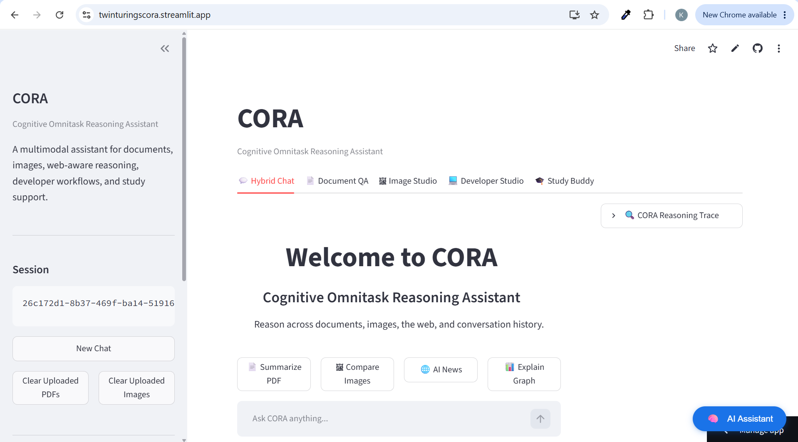
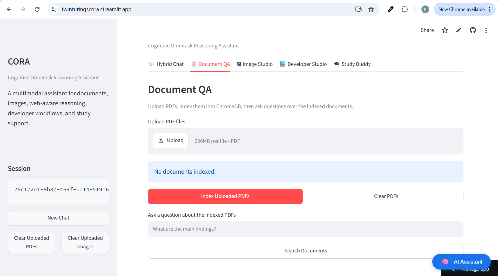
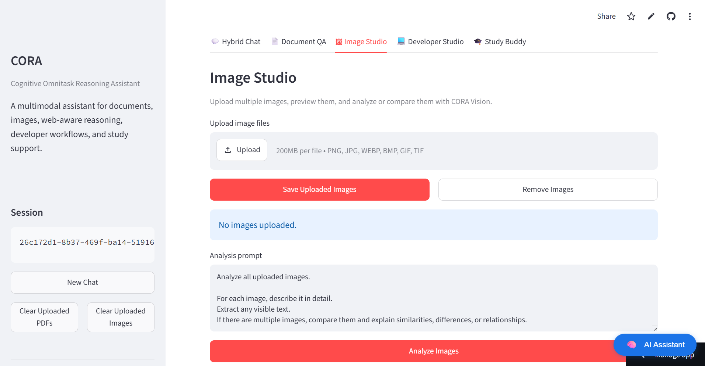
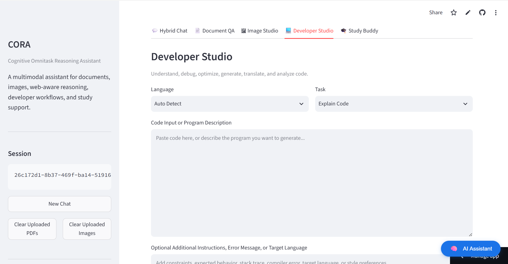

# CORA - Cognitive Omnitask Reasoning Assistant

> An AI productivity suite for reasoning across chat, documents, images, code, and study material.

## Live Demo

**Live Demo URL:**

https://twinturingscora.streamlit.app/

---

## Problem Statement

**Problem Statement 5 – Multimodal Q&A Pro: Full Hybrid Agent + Deployment**

Build a multimodal AI assistant capable of intelligently reasoning across multiple information sources using a single LangGraph ReAct agent.

The solution should:

- Accept PDF uploads indexed in ChromaDB.
- Accept image uploads analyzed through Groq Vision.
- Answer free-text user queries by dynamically routing to the appropriate tools.
- Support intelligent multi-tool reasoning across document search, web search, and image understanding.
- Display a real reasoning trace generated from the agent's execution.
- Provide dedicated workspaces for Hybrid Chat, Document Q&A, and Image Studio.
- Be deployed as a live multi-tab Streamlit application with secure API key management.

### Beyond the Problem Statement

CORA fully implements the required PS-5 functionality while extending it with additional productivity-focused capabilities, including:

- 🧑‍💻 **Developer Studio** for code explanation, debugging, optimization, generation, and test creation.
- 📚 **Study Buddy** for intelligent learning workflows such as summaries, quizzes, flashcards, revision sheets, and exam practice.
- 📝 Automatic handling of typed PDFs, scanned PDFs, handwritten notes, lecture slides, screenshots, and notebook scans through an intelligent document processing pipeline.
- 📖 Wikipedia integration as an additional knowledge source for stable factual queries.

---

## Description

CORA, short for **Cognitive Omnitask Reasoning Assistant**, is a multimodal AI productivity suite designed to help users work with different types of information in one cohesive interface.

The application combines conversational reasoning, document understanding, image analysis, developer assistance, and structured learning workflows. Instead of acting as a generic chatbot, CORA provides specialized workspaces for different productivity needs:

- **Hybrid Chat** for general reasoning across tools, documents, images, web search, and conversation memory.
- **Document QA** for uploading PDFs and asking retrieval-based questions.
- **Image Studio** for analyzing, comparing, and extracting text from images.
- **Developer Studio** for explaining, debugging, optimizing, generating, and testing code.
- **Study Buddy** for converting notes, PDFs, slides, screenshots, and handwritten study material into learning resources.

CORA is built to feel like an intelligent assistant that can move across tasks while keeping each workflow focused and purposeful.

---

## Approach

CORA uses a modular architecture where each major workspace has a focused responsibility.

The core approach is:

1. **Agentic reasoning for Hybrid Chat**
   - A LangGraph-based agent coordinates tool usage.
   - It can search the web, use Wikipedia, query uploaded PDFs, analyze images, and preserve conversation context.

2. **Retrieval-Augmented Generation for documents**
   - Uploaded PDFs are parsed, chunked, embedded, and stored in a persistent Chroma vector database.
   - User questions are answered using retrieved document context.

3. **Vision-based multimodal processing**
   - Uploaded images are sent to a vision-capable Groq model.
   - The same vision architecture is reused for handwritten notes, scanned documents, charts, screenshots, and whiteboard photos.

4. **Dedicated task-specific workspaces**
   - Developer Studio and Study Buddy use dedicated ChatGroq instances with specialized prompts.
   - This avoids creating one oversized prompt or another generic chatbot.

5. **Automatic study material handling**
   - Study Buddy detects whether uploaded PDFs contain extractable text.
   - Typed PDFs use direct text extraction.
   - Scanned or handwritten PDF pages are rendered as images and processed through the existing vision model.
   - Extracted content is merged into one unified study document before generating summaries, quizzes, flashcards, revision sheets, or explanations.

---

## Features

### Hybrid Chat

- LangGraph-powered reasoning agent
- Conversation memory
- Streaming responses
- Reasoning trace
- Web search
- Wikipedia search
- PDF RAG search
- Vision tool support

### Document QA

- Upload one or more PDF files
- Persistent Chroma vector store
- Retrieval-based document question answering
- Clear indexed documents when needed

### Image Studio

- Upload one or more images
- Analyze visual content
- Extract visible text
- Compare multiple images
- Works with charts, screenshots, diagrams, handwritten notes, and photos

### Developer Studio

Developer-focused workflows:

- Explain Code
- Debug Code
- Optimize Code
- Generate Code
- Generate Test Cases

Supported language options:

- Auto Detect
- Python
- C++
- Java
- JavaScript
- C#
- Go
- Rust

### Study Buddy

Structured learning workflows:

- Explain Topic
- Summarize Notes
- Generate Quiz
- Generate Flashcards
- Exam Practice
- Revision Sheet

Supported study material inputs:

- Typed PDFs
- Scanned PDFs
- Handwritten PDFs
- Lecture slides
- Images of notes
- Notebook scans
- Whiteboard photos
- Screenshots containing notes, equations, or diagrams

Study Buddy also supports Markdown and LaTeX rendering for mathematical and scientific content.

---

## Architecture

```text
CORA
|
|-- streamlit_app.py
|   |-- Streamlit UI
|   |-- Workspace tabs
|   |-- Session state
|   `-- UI wiring
|
|-- agent.py
|   |-- LangGraph agent
|   |-- Hybrid Chat reasoning
|   |-- Tool routing
|   |-- Streaming responses
|   `-- Reasoning trace
|
|-- tools_rag.py
|   |-- PDF loading
|   |-- Text splitting
|   |-- Embeddings
|   |-- Chroma vector store
|   `-- Document search tool
|
|-- tools_vision.py
|   |-- Vision model setup
|   |-- Image upload state
|   |-- Image analysis tool
|   `-- Reusable image-path analysis helper
|
|-- tools_web.py
|   `-- Web search utilities
|
|-- tools_wiki.py
|   `-- Wikipedia search utilities
|
|-- developer_studio.py
|   |-- Dedicated Developer Studio LLM
|   |-- Code explanation prompt
|   |-- Debugging prompt
|   |-- Optimization prompt
|   |-- Complexity analysis prompt
|   |-- Language conversion prompt
|   |-- Code generation prompt
|   `-- Test generation prompt
|
|-- study_buddy.py
|   |-- Dedicated Study Buddy LLM
|   |-- Study task prompts
|   |-- Typed PDF extraction
|   |-- Scanned PDF rendering
|   |-- Vision-based study material extraction
|   `-- Unified study document generation
|
|-- safe_call.py
|   `-- Error handling wrappers
|
`-- chroma_store/
    `-- Persistent vector database
```

---

## Tech Stack

### Frontend / UI

- Streamlit
- Streamlit chat, tabs, uploaders, expanders, and session state
- Markdown rendering
- LaTeX rendering for study outputs

### LLM and AI Orchestration

- LangChain
- LangGraph
- ChatGroq
- Groq text models
- Groq vision model

### Retrieval and Document Processing

- ChromaDB
- LangChain Chroma integration
- HuggingFace embeddings
- Sentence Transformers
- PyPDF
- PyPDFium2

### Tools and Utilities

- DuckDuckGo search
- Wikipedia API
- Python dotenv
- Safe error handling wrappers

---

## Setup Instructions

### 1. Clone the Repository

```bash
git clone https://github.com/Khushi2007/cora.git
cd CORA
```

### 2. Create a Virtual Environment

```bash
python -m venv venv
```

### 3. Activate the Virtual Environment

On Windows:

```bash
venv\Scripts\activate
```

On macOS/Linux:

```bash
source venv/bin/activate
```

### 4. Install Dependencies

```bash
pip install -r requirements.txt
```

### 5. Configure Environment Variables

Create a `.env` file in the project root:

```env
GROQ_API_KEY=your_groq_api_key_here
```

### 6. Run the Application

```bash
streamlit run streamlit_app.py
```

The app will start locally, usually at:

```text
http://localhost:8501
```

---

## Usage Guide

### Hybrid Chat

Use Hybrid Chat for general reasoning tasks. CORA can combine conversation memory, web search, Wikipedia, uploaded PDFs, and uploaded images when responding.

### Document QA

Upload PDFs in the Document QA tab. CORA indexes the documents into ChromaDB, supports direct document questions, and allows the Hybrid Chat agent to retrieve relevant document sections.

### Image Studio

Upload one or more images and run image analysis. CORA can describe images, extract text, compare visuals, and reason about diagrams or screenshots.

### Developer Studio

Choose a language, select a developer task, paste code or describe what you want to build, and run the workflow.

### Study Buddy

Choose a study task, enter a topic or notes, optionally upload PDFs or images, and generate structured learning material.

---

## Screenshots










---

## Video Demo

**Video Demo Google Drive URL**

https://drive.google.com/file/d/19qJffpPoFB4ABaO4bwWM9c8FzBqewH9m/view?usp=sharing

---

## Known Limitations

- The application depends on external LLM APIs, so internet access and a valid `GROQ_API_KEY` are required.
- Large PDFs or many scanned pages may take longer to process because image-based pages must be rendered and analyzed through the vision model.
- OCR accuracy for handwritten notes depends on handwriting clarity and image quality.
- Very long documents may exceed model context limits after extraction and may need summarization or chunking improvements in future versions.
- The Hybrid Chat agent and Document QA share document indexing state, so clearing documents removes the currently searchable PDF set.
- Mathematical formatting depends on the model emitting valid LaTeX.
- The app currently runs as a local Streamlit application and does not include authentication, user accounts, or multi-user document isolation.
- API rate limits from Groq or HuggingFace may affect availability during heavy usage.

---

## Future Improvements

- Add user authentication and workspace persistence
- Add export options for Study Buddy outputs
- Add downloadable flashcards
- Add quiz answer reveal interactions
- Add support for more document formats
- Add better chunking for very large study materials
- Add deployment-ready configuration
- Add automated tests for each workspace

---

## Acknowledgements

Built using:

- Streamlit
- LangChain
- LangGraph
- Groq
- ChromaDB
- HuggingFace Embeddings
- PyPDF
- DuckDuckGo Search
- Wikipedia API
